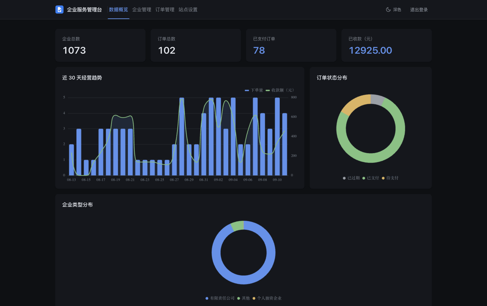
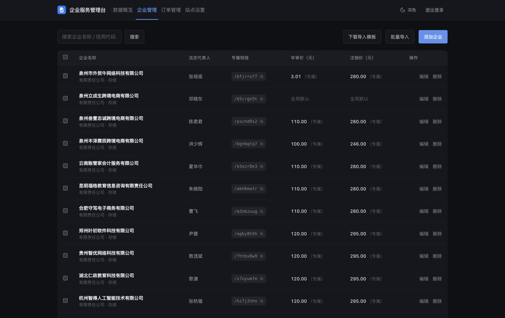

# Enterprise Service Platform

[简体中文](./README.md) | English

Empowering enterprise digitalization with custom development and maintenance.

This repository is for showcasing the enterprise service platform only — it contains no runnable code. The platform serves B2B enterprise clients with secondary development, custom feature development, and long-term technical operations & maintenance.

## Platform Preview

**Live site**: [https://qifuw.itcox.cn](https://qifuw.itcox.cn)

**User-facing web (mobile H5)**

<table>
  <tr>
    <td width="50%"></td>
    <td width="50%"></td>
  </tr>
</table>

**Admin dashboard (desktop)**

<table>
  <tr>
    <td width="50%"></td>
    <td width="50%"></td>
  </tr>
</table>

## Feature Highlights

- **Per-company short-link pages**: One shareable short link per company, server-side rendered for SEO, with company-specific info, compliance tips, and pricing.
- **Online payments**: Full WeChat Pay coverage (in-app, mobile browser, desktop QR), with callback signature verification plus polling for reliable order tracking.
- **Admin dashboard**: Company profiles, per-company pricing, order management, and site content/SEO settings — ready out of the box.
- **Bulk operations**: Excel-template bulk import and batch pricing, built for high-volume filing services.

> Decoupled frontend/backend architecture (Nuxt SSR + Vue 3 + Elysia), Docker-ready for one-command deployment, customizable and self-hosted on request.

## What We Offer

- **Custom development**: Tailored feature modules, UI, and business workflows built around your real business needs.
- **System integration**: Seamless integration with your existing systems (OA, ERP, finance, etc.).
- **Ongoing maintenance**: Long-term technical support, upgrades, and incident response to keep your platform stable.

## Contact Us

Open to enterprise partnership and custom project inquiries

Scan the QR code to add us on WeCom and get a custom proposal:

  

