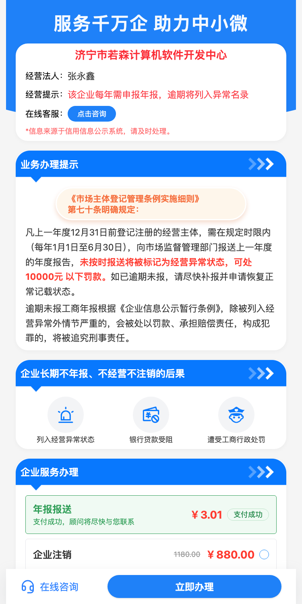
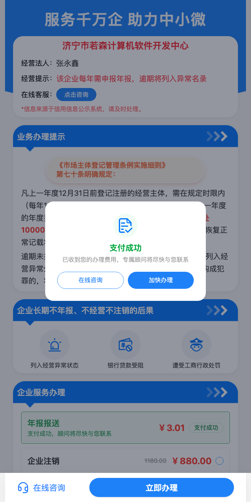
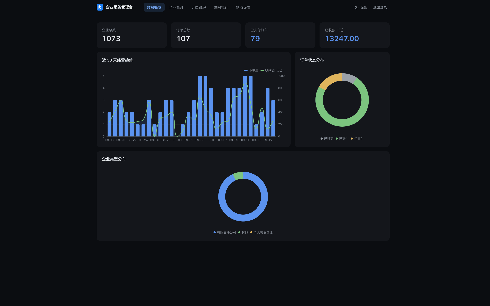
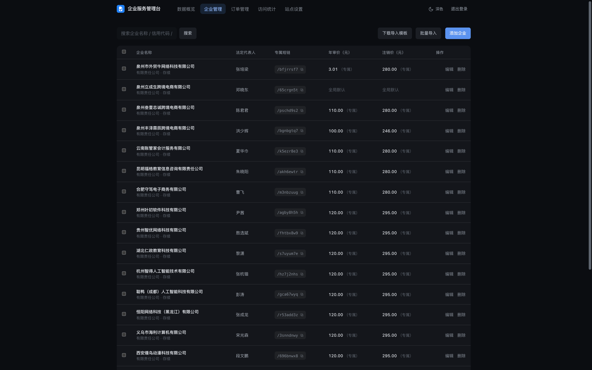
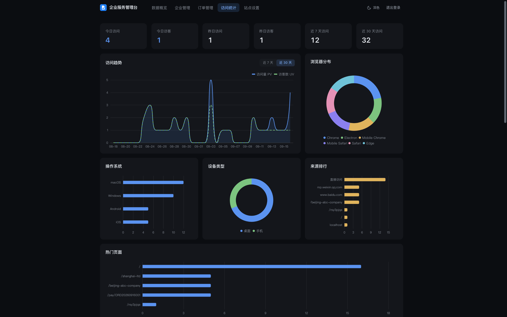

# 企业服务平台

简体中文 | [English](./README.en.md)

助力企业数字化，专属定制开发与维护。

本仓库仅用于展示企业服务平台相关介绍与服务内容，不包含可运行代码。平台面向 B 端企业客户，提供平台二次开发、定制化功能开发与长期技术运维服务。

## 平台预览

**平台地址**：[https://qifuw.itcox.cn](https://qifuw.itcox.cn)

**管理后台在线预览**：[https://qifuw.itcox.cn/admin/](https://qifuw.itcox.cn/admin/)

> [!TIP]
> 预览模式：数据均为模拟数据，仅供查看；打开即自动进入，无需注册登录。

**用户端（移动端 H5）**

<table>
  <tr>
    <td width="50%"></td>
    <td width="50%"></td>
  </tr>
</table>

**管理后台（桌面端）**

<table>
  <tr>
    <td width="50%">
      
      
    </td>
    <td width="50%" valign="middle"></td>
  </tr>
</table>

## 功能亮点

- **企业专属短链页**：每个企业一个短链页面，SSR 服务端渲染，利于搜索引擎收录；企业信息、经营提示、专属价格按企业个性化展示。
- **在线支付**：微信支付全场景支持（微信内、手机浏览器、电脑端扫码），回调验签 + 轮询双保险，订单自动落库。
- **管理后台**：企业档案、单独定价、订单列表、站点内容与 SEO 设置，开箱即用。
- **访问统计**：内置访客分析（PV/UV 趋势、来源与页面热度、设备与浏览器分布），推广效果一目了然。
- **批量运营**：Excel 模板批量导入企业、批量定价，适配批量代报业务。

> 前后端分离架构（Nuxt SSR + Vue 3 + Elysia），支持 Docker 一键部署，可按需定制与私有化交付。

## 我们能做什么

<table>
  <tr>
    <td width="34%" align="center" valign="middle">
      
    </td>
    <td width="66%" valign="top">

- **专属定制开发**：根据企业实际业务需求，深度定制功能模块、界面风格、业务流程，打造专属企业服务平台。
- **系统集成与对接**：支持与企业现有系统（如OA、ERP、财务等）无缝集成，提升信息流转效率。
- **持续技术维护**：提供长期技术支持、系统升级、故障响应，保障平台稳定运行。
- **合规与安全保障**：严格遵循数据安全与合规要求，助力企业无忧经营。
- **专属顾问服务**：配备资深项目经理与开发团队，全流程对接，确保项目高效落地。

    </td>
  </tr>
</table>
